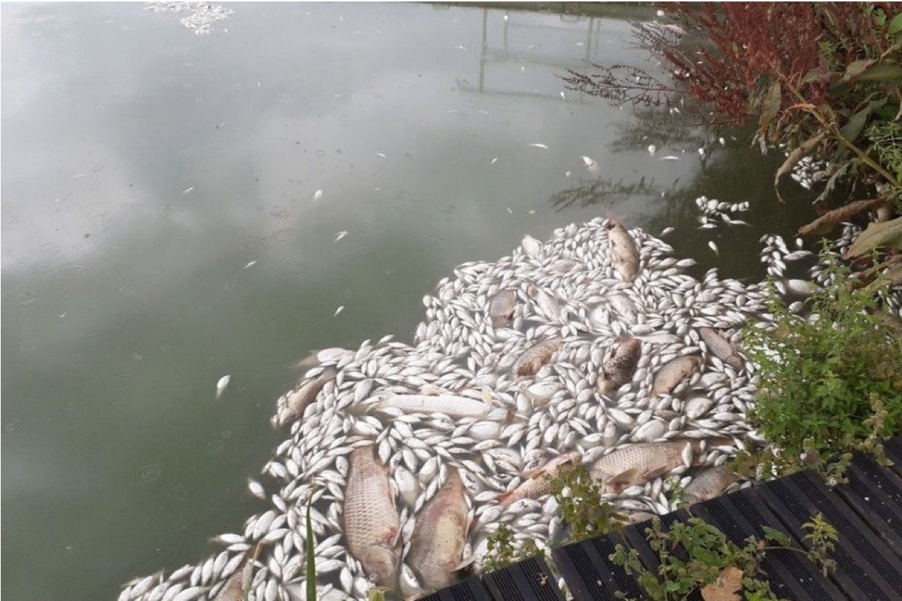

# Canicules : prémisses des difficultés à venir

  

    
La canicule d’août 2020 à montré l'impact des fortes chaleur à l'échelle locale avec plus de 10 tonnes de poissons retrouvés morts.

    
<em>"A cause de la sécheresse, les sources qui alimentent le lac se sont taries. L'orage qui s'est abattu est venu lessiver la route et les dépôts d'hydrocarbures qui ont ainsi pollués le lac." </em>

    
Un cocktail mortel pour les poissons.

  

  

    
  

(source : <a href="https://france3-regions.francetvinfo.fr">france3-regions.francetvinfo.fr</a>)

