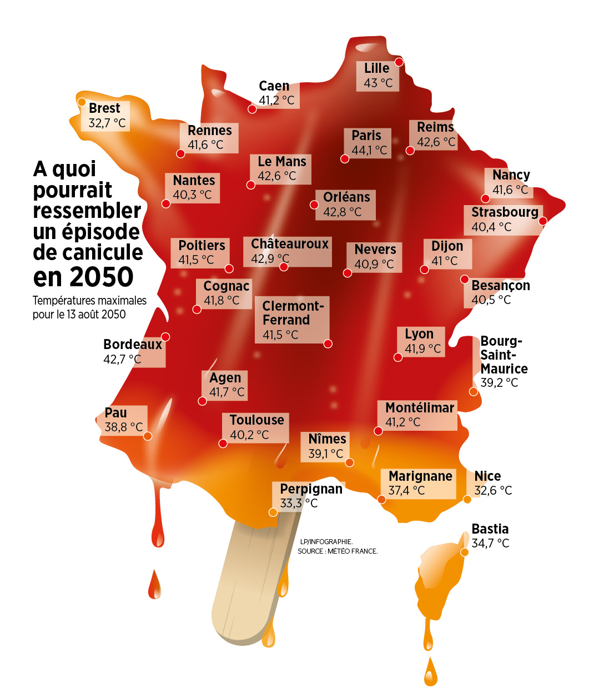

# Une Canicule en 2050, ça donnerait quoi ?

  
en 2050 une vague de chaleur sera de 1,2/1,5°C plus chaude que celle que nous venons de connaître [en 2020], selon scénario «laisser faire», #GIEC
  

  

    
  

(source : météo-france)

