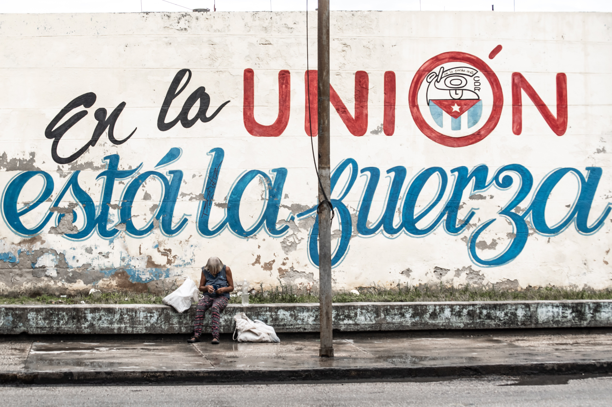

# Cuba : laisser la place à l’art

(source: <a href="https://unsplash.com/">unsplash.com</a>)

Note: lorsqu’on laisse le pouvoir aux personnes, celles-ci savent embêlir leurs lieux de vie. Les contraintes administratives ou légales ne sont qu'une facette d'un besoin de pouvoir des instances politiques. L’auto-régulation des actions entre populations locales existait bien avant nos systèmes politiques actuels.
