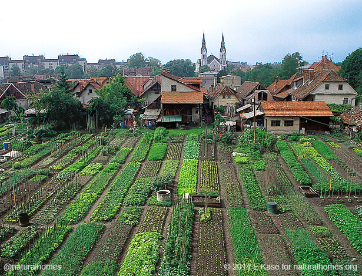

# Cuba : utiliser les espaces cultivable

(source: <a href="https://naturalhomes.org/">naturalhomes.org</a>)

Note: Les fermes urbaines sont de magnifiques exemples d’intégration de la nature dans les villes.
