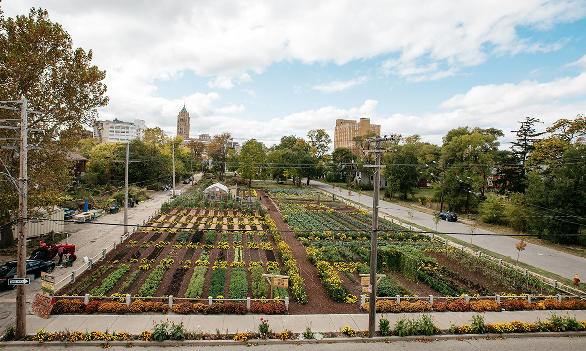

# Detroit, rebond d’une population abandonnée

- De presque 2 millions d'habitants à 700 milles en quelques années
- Développements de fermes urbaines
- Réutilisation des espaces vacants disponibles

(source: <a href="https://www.yesmagazine.org/social-justice/2019/11/05/food-community-detroit-garden-agriculture/">Photo by Michelle Gerard</a>)

Note: suite au déclin de l'automobile, Détroit a perdu l'essentiel de sa population riche qui a quitté la ville. Seules les populations pauvres sont restées, et malgré la crise des subprimes et les expropriations, ils ont su devenir résilients et adapter d'anciennes friches industrielles au profit de cultures locales.
