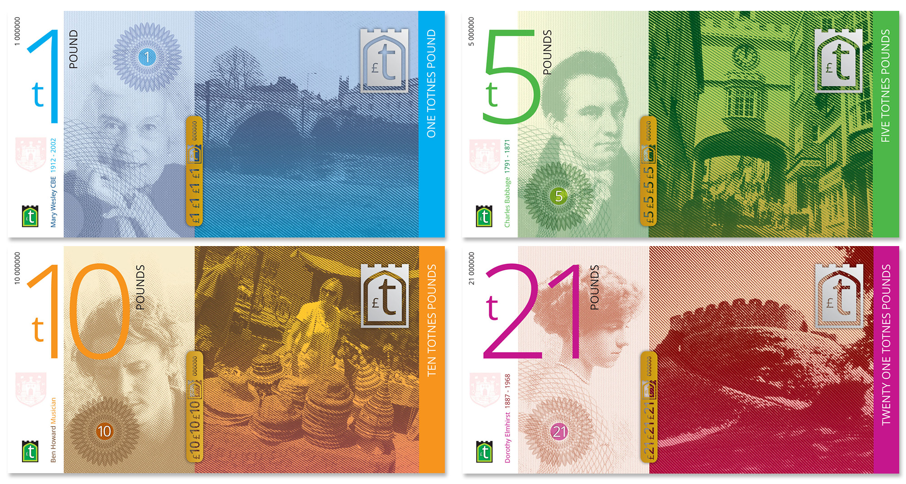

# Totnes, Angleterre

- C'est la première **"ville en transition"**
- Un modèle de diversité d'idées développées par ses habitants
  - agriculture urbaine libre d'accès
  - la « Totnes pound », monnaie locale favorisant le commerce locale
- [« Manuel de Transition »](https://ecosociete.org/livres/manuel-de-transition) par Rob Hopkins

<a href="https://reporterre.net/A-Totnes-la-transition-se-porte">(en savoir plus)</a>

